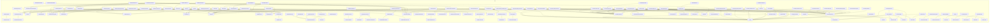

# Composable Dependency Graph

```mermaid
flowchart LR
  subgraph root
    useAdminAgenda
    useAdminContacts
    useAdminAnunciantes
    useAdminAdvertisements
    useAdminAuctionList
    useToast
    useAdminBalanceUI
    useAdminBalance
    useAdminSubcategories
    useAdminTypes
    useAdminVehicles
    useSiteName
    useSiteUrl
    useAdminBanner
    useAdminConfig
    useAdminCaracteristicas
    useAdminFilters
    useAdminChats
    useAdminChat
    useAdminDashboard
    useAdminMetrics
    useAdminDashboardPage
    useAdminEmails
    useAdminVerticalConfig
    useSanitize
    useAdminFacturacion
    useRevenueMetrics
    useAdminHistoricoPage
    useAdminHistorico
    useAdminHomepage
    useAdminInfrastructura
    useInfraMetrics
    useInfraRecommendations
    useAdminLanguages
    useAdminMetricsActivity
    useAdminMetricsRevenue
    useAdminNavigation
    useAdminNewsCreate
    useAdminNews
    useCloudinaryUpload
    useSeoScore
    useAdminNewsForm
    useAdminNoticiaForm
    useAdminNoticiasIndex
    useAdminProductForm
    useAdminProductRecords
    useAdminProductoDetail
    useAdminProductoDetailImages
    useAdminProductoDetailRecords
    useAdminProductoDetailVerif
    useGoogleDrive
    useVehicleVerification
    useAdminProductoNuevo
    useAdminProductosPage
    useAdminProductosColumns
    useAdminProductosSort
    useAdminPublicidad
    useAdminAdDashboard
    useAdminSidebar
    useVerticalConfig
    useAdminSolicitantes
    useAdminDemands
    useAdminSubcategoriasPage
    useAdminTiposPage
    useAdminUsuariosPage
    useAdminUsers
    useAdminVehicleDetail
    useGoogleDriveFolders
    useInvoiceGenerator
    useSocialAdminUI
    useSocialPublisher
    useFilterBar
    useAuth
    useCatalogState
    useFilters
    useUserLocation
    useGeoFallback
    useVehicles
    useSimilarSearches
    useVehicleTable
    useFavorites
    useDashboardAlquileres
    useDealerDashboard
    useSubscriptionPlan
    useDashboardCalculadora
    useFinanceCalculator
    useDashboardContrato
    useDashboardContratoHistory
    useFormAutosave
    useDashboardExportar
    useDashboardExportarAnuncio
    useDashboardFactura
    useInvoice
    useDashboardHistorico
    useDashboardImportar
    useDashboardIndex
    useDealerHealthScore
    useDashboardMantenimientos
    useDashboardMercado
    useDashboardMerchandising
    useDashboardNuevoVehiculo
    useDashboardObservatorio
    useDashboardPipeline
    useDashboardPresupuesto
    useDashboardTransaccion
    useDashboardVehiculoDetail
    useDashboardVisitas
    useDashboardWidget
    useInvoiceData
    useAdvertiseModal
    useVehicleTypeSelector
    useAuctionDetail
    useAuction
    useAuctionRegistration
    useBuyerDashboard
    useDatos
    useDealerTheme
    useFeatureGate
    useFeatureFlag
    useGtag
    useConsent
    useHreflang
    useListingRenewal
    useListingLifecycle
    usePageSeo
    usePerfilAlertas
    usePerfilComparador
    useVehicleComparator
    usePerfilMensajes
    useConversation
    useImageUrl
    usePerfilReservas
    useReservation
    useUserPanel
    useUserChat
    useAnalyticsTracking
    useScrollDepth
    useJsonLd
    useSubastasIndex
    useVendedorDetail
    useSellerProfile
  end
  useAdminAgenda --> useAdminContacts
  useAdminAnunciantes --> useAdminAdvertisements
  useAdminAuctionList --> useToast
  useAdminBalanceUI --> useAdminBalance
  useAdminBalanceUI --> useAdminSubcategories
  useAdminBalanceUI --> useAdminTypes
  useAdminBalanceUI --> useAdminVehicles
  useAdminBalanceUI --> useSiteName
  useAdminBalanceUI --> useSiteUrl
  useAdminBalanceUI --> useToast
  useAdminBanner --> useAdminConfig
  useAdminBanner --> useToast
  useAdminCaracteristicas --> useAdminFilters
  useAdminCaracteristicas --> useToast
  useAdminChats --> useAdminChat
  useAdminDashboard --> useAdminMetrics
  useAdminDashboardPage --> useAdminMetrics
  useAdminEmails --> useAdminVerticalConfig
  useAdminEmails --> useSanitize
  useAdminFacturacion --> useRevenueMetrics
  useAdminHistoricoPage --> useAdminHistorico
  useAdminHistoricoPage --> useSiteUrl
  useAdminHomepage --> useAdminVerticalConfig
  useAdminInfrastructura --> useInfraMetrics
  useAdminInfrastructura --> useInfraRecommendations
  useAdminLanguages --> useAdminVerticalConfig
  useAdminMetrics --> useAdminMetricsActivity
  useAdminMetrics --> useAdminMetricsRevenue
  useAdminNavigation --> useAdminVerticalConfig
  useAdminNewsCreate --> useAdminNews
  useAdminNewsCreate --> useCloudinaryUpload
  useAdminNewsCreate --> useSeoScore
  useAdminNewsForm --> useAdminNews
  useAdminNewsForm --> useCloudinaryUpload
  useAdminNewsForm --> useSeoScore
  useAdminNoticiaForm --> useAdminNews
  useAdminNoticiaForm --> useCloudinaryUpload
  useAdminNoticiaForm --> useSeoScore
  useAdminNoticiasIndex --> useAdminNews
  useAdminProductForm --> useAdminFilters
  useAdminProductForm --> useAdminProductRecords
  useAdminProductForm --> useAdminSubcategories
  useAdminProductForm --> useAdminTypes
  useAdminProductForm --> useAdminVehicles
  useAdminProductForm --> useCloudinaryUpload
  useAdminProductForm --> useToast
  useAdminProductoDetail --> useAdminFilters
  useAdminProductoDetail --> useAdminProductoDetailImages
  useAdminProductoDetail --> useAdminProductoDetailRecords
  useAdminProductoDetail --> useAdminProductoDetailVerif
  useAdminProductoDetail --> useAdminSubcategories
  useAdminProductoDetail --> useAdminTypes
  useAdminProductoDetail --> useAdminVehicles
  useAdminProductoDetail --> useCloudinaryUpload
  useAdminProductoDetail --> useToast
  useAdminProductoDetailImages --> useToast
  useAdminProductoDetailRecords --> useGoogleDrive
  useAdminProductoDetailVerif --> useVehicleVerification
  useAdminProductoNuevo --> useAdminProductForm
  useAdminProductosPage --> useAdminFilters
  useAdminProductosPage --> useAdminProductosColumns
  useAdminProductosPage --> useAdminProductosSort
  useAdminProductosPage --> useAdminSubcategories
  useAdminProductosPage --> useAdminTypes
  useAdminProductosPage --> useAdminVehicles
  useAdminProductosPage --> useGoogleDrive
  useAdminProductosPage --> useToast
  useAdminPublicidad --> useAdminAdDashboard
  useAdminSidebar --> useSiteName
  useAdminSidebar --> useVerticalConfig
  useAdminSolicitantes --> useAdminDemands
  useAdminSubcategoriasPage --> useAdminFilters
  useAdminSubcategoriasPage --> useAdminSubcategories
  useAdminSubcategoriasPage --> useToast
  useAdminTiposPage --> useAdminFilters
  useAdminTiposPage --> useAdminSubcategories
  useAdminTiposPage --> useAdminTypes
  useAdminTiposPage --> useToast
  useAdminUsuariosPage --> useAdminUsers
  useAdminVehicleDetail --> useAdminVehicles
  useGoogleDrive --> useGoogleDriveFolders
  useInvoiceGenerator --> useSiteUrl
  useSeoScore --> useSiteUrl
  useSocialAdminUI --> useSocialPublisher
  useFilterBar --> useAuth
  useFilterBar --> useCatalogState
  useFilterBar --> useFilters
  useFilterBar --> useUserLocation
  useGeoFallback --> useCatalogState
  useGeoFallback --> useUserLocation
  useGeoFallback --> useVehicles
  useSimilarSearches --> useGeoFallback
  useSimilarSearches --> useCatalogState
  useSimilarSearches --> useVehicles
  useVehicleTable --> useFavorites
  useVehicleTable --> useUserLocation
  useDashboardAlquileres --> useAuth
  useDashboardAlquileres --> useDealerDashboard
  useDashboardAlquileres --> useSubscriptionPlan
  useDashboardCalculadora --> useFinanceCalculator
  useDashboardContrato --> useDashboardContratoHistory
  useDashboardContrato --> useAuth
  useDashboardContrato --> useDealerDashboard
  useDashboardContrato --> useFormAutosave
  useDashboardContrato --> useSubscriptionPlan
  useDashboardExportar --> useAuth
  useDashboardExportar --> useDealerDashboard
  useDashboardExportar --> useSiteName
  useDashboardExportar --> useSiteUrl
  useDashboardExportar --> useSubscriptionPlan
  useDashboardExportarAnuncio --> useAuth
  useDashboardExportarAnuncio --> useDealerDashboard
  useDashboardExportarAnuncio --> useSiteUrl
  useDashboardExportarAnuncio --> useSubscriptionPlan
  useDashboardFactura --> useInvoice
  useDashboardHistorico --> useDealerDashboard
  useDashboardImportar --> useAuth
  useDashboardImportar --> useDealerDashboard
  useDashboardImportar --> useSubscriptionPlan
  useDashboardIndex --> useAuth
  useDashboardIndex --> useDealerDashboard
  useDashboardIndex --> useDealerHealthScore
  useDashboardIndex --> useSubscriptionPlan
  useDashboardMantenimientos --> useAuth
  useDashboardMantenimientos --> useDealerDashboard
  useDashboardMantenimientos --> useSubscriptionPlan
  useDashboardMercado --> useDealerDashboard
  useDashboardMerchandising --> useDealerDashboard
  useDashboardNuevoVehiculo --> useAuth
  useDashboardNuevoVehiculo --> useDealerDashboard
  useDashboardNuevoVehiculo --> useSubscriptionPlan
  useDashboardObservatorio --> useAuth
  useDashboardObservatorio --> useDealerDashboard
  useDashboardObservatorio --> useSubscriptionPlan
  useDashboardPipeline --> useAuth
  useDashboardPipeline --> useSubscriptionPlan
  useDashboardPresupuesto --> useDealerDashboard
  useDashboardTransaccion --> useAuth
  useDashboardTransaccion --> useDealerDashboard
  useDashboardVehiculoDetail --> useCloudinaryUpload
  useDashboardVehiculoDetail --> useAuth
  useDashboardVehiculoDetail --> useDealerDashboard
  useDashboardVehiculoDetail --> useSubscriptionPlan
  useDashboardVehiculoDetail --> useVehicleVerification
  useDashboardVisitas --> useDealerDashboard
  useDashboardWidget --> useAuth
  useDashboardWidget --> useDealerDashboard
  useDashboardWidget --> useSiteUrl
  useDashboardWidget --> useSubscriptionPlan
  useInvoice --> useInvoiceData
  useInvoice --> useAuth
  useInvoice --> useDealerDashboard
  useInvoice --> useFormAutosave
  useInvoice --> useSubscriptionPlan
  useAdvertiseModal --> useVehicleTypeSelector
  useAuctionDetail --> useCloudinaryUpload
  useAuctionDetail --> useAuction
  useAuctionDetail --> useAuctionRegistration
  useAuctionDetail --> useSiteUrl
  useAuctionDetail --> useToast
  useBuyerDashboard --> useAuth
  useDatos --> useSiteUrl
  useDealerDashboard --> useAuth
  useDealerTheme --> useVerticalConfig
  useFeatureGate --> useFeatureFlag
  useFeatureGate --> useSubscriptionPlan
  useGtag --> useConsent
  useHreflang --> useSiteUrl
  useListingRenewal --> useListingLifecycle
  usePageSeo --> useSiteUrl
  usePerfilAlertas --> useAuth
  usePerfilComparador --> useVehicleComparator
  usePerfilMensajes --> useConversation
  usePerfilMensajes --> useImageUrl
  usePerfilReservas --> useReservation
  useUserPanel --> useAuth
  useUserPanel --> useFavorites
  useUserPanel --> useUserChat
  useReservation --> useAnalyticsTracking
  useReservation --> useSubscriptionPlan
  useScrollDepth --> useAnalyticsTracking
  useSocialPublisher --> useSiteUrl
  useJsonLd --> useSiteName
  useJsonLd --> useSiteUrl
  useSubastasIndex --> useAuction
  useSubastasIndex --> usePageSeo
  useSubastasIndex --> useSiteUrl
  useVehicleComparator --> useSubscriptionPlan
  useVendedorDetail --> useSellerProfile
  useVendedorDetail --> useSiteUrl
```

**Generated:** 2026-03-19
**Total composables:** 248
**Total dependencies:** 190
**Files scanned:** 268
