# Entity Relationship Diagram

> Generated from 80 migrations (00001-00066 + 14 timestamped). 92 tables in `public` schema.
> Last updated: Mar 2026.

```mermaid
erDiagram
    users ||--o{ dealers : "owns"
    users ||--o{ favorites : "has"
    users ||--o{ search_alerts : "creates"
    users ||--o{ reservations : "makes"
    users ||--o{ auction_bids : "places"
    users ||--o{ activity_logs : "generates"
    users ||--o{ user_credits : "has"
    users ||--o{ profiles : "has"
    users ||--o{ consents : "gives"
    users ||--o{ email_preferences : "sets"
    users ||--o{ push_subscriptions : "registers"
    users ||--o{ vehicle_comparisons : "creates"
    users ||--o{ user_vehicle_views : "tracks"
    users ||--o{ user_ad_profiles : "has"
    users ||--o{ analytics_events : "generates"

    dealers ||--o{ vehicles : "publishes"
    dealers ||--o{ subscriptions : "has"
    dealers ||--o{ dealer_leads : "receives"
    dealers ||--o{ dealer_stats : "tracks"
    dealers ||--o{ dealer_events : "logs"
    dealers ||--o{ dealer_fiscal_data : "stores"
    dealers ||--o{ dealer_invoices : "generates"
    dealers ||--o{ dealer_stripe_accounts : "connects"
    dealers ||--o{ dealer_platforms : "syncs"
    dealers ||--o{ dealer_quotes : "creates"
    dealers ||--o{ dealer_contracts : "signs"
    dealers ||--o{ whatsapp_submissions : "sends"
    dealers ||--o{ merch_orders : "places"
    dealers ||--o{ visit_slots : "configures"

    vehicles ||--o{ vehicle_images : "has"
    vehicles ||--o{ user_vehicle_views : "tracks"
    vehicles ||--o{ favorites : "receives"
    vehicles ||--o{ reservations : "has"
    vehicles ||--o{ auction_bids : "receives"
    vehicles ||--o{ verification_documents : "requires"
    vehicles ||--o{ price_history : "records"
    vehicles ||--o{ pipeline_items : "stages"
    vehicles ||--o{ maintenance_records : "logs"
    vehicles ||--o{ rental_records : "tracks"
    vehicles ||--o{ social_posts : "promotes"
    vehicles ||--o{ service_requests : "generates"
    vehicles ||--o{ historico : "archives"

    categories ||--o{ subcategories : "contains"
    categories ||--o{ vehicles : "classifies"
    subcategories ||--o{ subcategory_categories : "links"

    articles ||--o{ content_translations : "has"
    articles ||--o{ comments : "receives"

    subscriptions ||--o{ invoices : "generates"

    auctions ||--o{ auction_bids : "receives"
    auctions ||--o{ auction_registrations : "accepts"
    auctions }o--|| vehicles : "sells"

    advertisements ||--o{ ad_events : "tracks"
    ads ||--o{ ad_events : "tracks"
    ads ||--o{ ad_revenue_log : "earns"

    conversations ||--o{ conversation_messages : "contains"

    credit_packs ||--o{ credit_transactions : "fulfills"
    user_credits ||--o{ credit_transactions : "records"

    infra_clusters ||--o{ infra_alerts : "generates"
    infra_clusters ||--o{ infra_metrics : "measures"

    visit_slots ||--o{ visit_bookings : "schedules"

    vertical_config ||--o{ categories : "defines"
    vertical_config ||--o{ dealers : "scopes"
    vertical_config ||--o{ vehicles : "scopes"
    vertical_config ||--o{ articles : "scopes"

    locations ||--o{ vehicles : "locates"
```

## All Tables (92)

| Table                      | RLS | Vertical | Description                                  |
| -------------------------- | --- | -------- | -------------------------------------------- |
| **Core**                   |     |          |                                              |
| `users`                    | Yes | No       | Auth users (Supabase Auth)                   |
| `profiles`                 | Yes | No       | Extended user profiles                       |
| `dealers`                  | Yes | Yes      | Business accounts                            |
| `vehicles`                 | Yes | Yes      | Vehicle listings                             |
| `vehicle_images`           | Yes | No       | Images per vehicle                           |
| `categories`               | Yes | Yes      | Dynamic categories                           |
| `subcategories`            | Yes | Yes      | Nested under categories                      |
| `subcategory_categories`   | Yes | No       | Many-to-many subcategory-category            |
| `articles`                 | Yes | Yes      | Blog posts and guides                        |
| `content_translations`     | Yes | No       | Long-form translations (JSONB)               |
| `vertical_config`          | Yes | No       | Multi-vertical settings                      |
| `config`                   | Yes | No       | Global configuration key-value               |
| `actions`                  | Yes | Yes      | Dynamic action types (buy/sell/rent/auction) |
| `attributes`               | Yes | No       | Dynamic vehicle attributes                   |
| `brands`                   | Yes | No       | Vehicle brands                               |
| `locations`                | Yes | No       | Hierarchical location tree                   |
| `geo_regions`              | No  | No       | Geographic region definitions                |
| `geocoding_cache`          | No  | No       | Geocoding API response cache                 |
| **User engagement**        |     |          |                                              |
| `favorites`                | Yes | No       | User favorites                               |
| `search_alerts`            | Yes | No       | Saved search alerts                          |
| `search_logs`              | Yes | No       | Search query logging                         |
| `user_vehicle_views`       | Yes | No       | Per-user vehicle view tracking               |
| `vehicle_comparisons`      | Yes | No       | Vehicle comparison sessions                  |
| `comparison_notes`         | Yes | No       | Notes on comparisons                         |
| `comments`                 | Yes | No       | Article comments                             |
| `seller_reviews`           | Yes | No       | Seller rating and reviews                    |
| `activity_logs`            | Yes | No       | User activity tracking                       |
| `analytics_events`         | Yes | No       | Frontend analytics events                    |
| `consents`                 | Yes | No       | GDPR consent records                         |
| **Messaging**              |     |          |                                              |
| `conversations`            | Yes | No       | Buyer-seller conversations                   |
| `conversation_messages`    | Yes | No       | Messages within conversations                |
| `chat_messages`            | Yes | No       | Legacy chat messages                         |
| `contacts`                 | Yes | No       | Contact form submissions                     |
| **Commerce**               |     |          |                                              |
| `reservations`             | Yes | No       | Vehicle reservations                         |
| `auctions`                 | Yes | No       | Auction listings                             |
| `auction_bids`             | Yes | No       | Bids on auctions                             |
| `auction_registrations`    | Yes | No       | Auction participant registrations            |
| `subscriptions`            | Yes | No       | Dealer subscriptions (Stripe)                |
| `invoices`                 | Yes | No       | Billing invoices                             |
| `payments`                 | Yes | No       | Payment records                              |
| `balance`                  | Yes | No       | Dealer balance tracking                      |
| `price_history`            | Yes | No       | Vehicle price change history                 |
| `historico`                | Yes | No       | Archived/sold vehicle records                |
| `transport_requests`       | Yes | No       | Transport service requests                   |
| `transport_zones`          | No  | No       | Transport zone definitions and pricing       |
| `service_requests`         | Yes | No       | Post-sale service requests                   |
| **Credits**                |     |          |                                              |
| `credit_packs`             | Yes | No       | Available credit pack definitions            |
| `credit_transactions`      | Yes | No       | Credit purchase/spend log                    |
| `user_credits`             | Yes | No       | User credit balances                         |
| **Dealer tools**           |     |          |                                              |
| `dealer_leads`             | Yes | No       | Lead capture                                 |
| `leads`                    | Yes | No       | General leads                                |
| `dealer_stats`             | Yes | No       | Dealer performance statistics                |
| `dealer_events`            | Yes | No       | Dealer activity events                       |
| `dealer_fiscal_data`       | Yes | No       | Dealer tax/fiscal information                |
| `dealer_invoices`          | Yes | No       | Dealer-generated invoices                    |
| `dealer_stripe_accounts`   | Yes | No       | Stripe Connect accounts                      |
| `dealer_platforms`         | Yes | No       | External platform sync config                |
| `dealer_quotes`            | Yes | No       | Dealer price quotes                          |
| `dealer_contracts`         | Yes | No       | Signed contracts                             |
| `pipeline_items`           | Yes | No       | Sales pipeline / kanban                      |
| `maintenance_records`      | Yes | No       | Vehicle maintenance log                      |
| `rental_records`           | Yes | No       | Vehicle rental tracking                      |
| `visit_slots`              | Yes | No       | Dealer visit time slots                      |
| `visit_bookings`           | Yes | No       | Buyer visit reservations                     |
| `merch_orders`             | Yes | No       | Merchandising orders                         |
| `whatsapp_submissions`     | Yes | No       | WhatsApp vehicle submissions                 |
| **Verification**           |     |          |                                              |
| `verification_documents`   | Yes | No       | Document verification                        |
| **Advertising**            |     |          |                                              |
| `advertisements`           | Yes | Yes      | User-submitted ad requests                   |
| `demands`                  | Yes | Yes      | User-submitted vehicle demands               |
| `advertisers`              | Yes | No       | Advertiser accounts                          |
| `ads`                      | Yes | No       | Managed ad placements                        |
| `ad_events`                | No  | No       | Ad impression/click tracking                 |
| `ad_floor_prices`          | No  | No       | Minimum CPM per placement                    |
| `ad_revenue_log`           | No  | No       | Ad revenue tracking                          |
| `user_ad_profiles`         | Yes | No       | User interest profiles for targeting         |
| **Content & social**       |     |          |                                              |
| `news`                     | Yes | Yes      | News articles (legacy)                       |
| `social_posts`             | Yes | No       | Generated social media posts                 |
| `active_landings`          | Yes | Yes      | Active landing page configs                  |
| `newsletter_subscriptions` | Yes | No       | Newsletter signup records                    |
| **Email**                  |     |          |                                              |
| `email_preferences`        | Yes | No       | User email opt-in/out                        |
| `push_subscriptions`       | Yes | No       | Web push notification subscriptions          |
| `email_logs`               | Yes | No       | Sent email log                               |
| **Data & market**          |     |          |                                              |
| `market_data`              | No  | No       | Market price/volume data                     |
| `competitor_vehicles`      | No  | No       | Scraped competitor listings                  |
| `demand_data`              | No  | No       | Aggregated demand signals                    |
| `data_subscriptions`       | Yes | No       | API data product subscriptions               |
| `api_usage`                | No  | No       | API call tracking                            |
| `platforms`                | No  | No       | External platform definitions                |
| **Infrastructure**         |     |          |                                              |
| `infra_clusters`           | No  | No       | Infrastructure cluster definitions           |
| `infra_alerts`             | No  | No       | Infrastructure alerts                        |
| `infra_metrics`            | No  | No       | Infrastructure metric snapshots              |
| `feature_flags`            | Yes | No       | Feature flag toggles                         |
| `reports`                  | Yes | No       | User-submitted reports                       |

## Migrations

80 migrations (00001-00066 + 14 timestamped) covering:

- Schema creation and evolution (00001-00015)
- Dynamic filters, subcategories, types (00016-00029)
- Subscriptions, admin, activity (00030-00037)
- Verification, auctions, transport (00038-00042)
- Email system, WhatsApp, push (00043-00048)
- Vertical migration, CRM, dealer tools (00049-00053)
- RLS hardening, performance indexes (00054-00058)
- Ads, buyer experience, founding (00059-00061)
- Vertical isolation, feature flags (00062-00064)
- Missing tables backfill, missing indexes (00065-00066)
- Check constraints, RLS fixes, infra fixes (timestamped 20260228-\*)
- Credits, profiles, seller response tracking (timestamped 20260301-\*)
