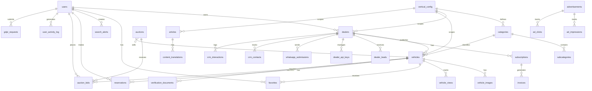

# Entity Relationship Diagram

> Generated from migrations 00001-00063. Simplified view showing key entities and relationships.

## Key Tables

| Table                    | RLS | Vertical | Description                    |
| ------------------------ | --- | -------- | ------------------------------ |
| `users`                  | Yes | No       | Auth users (Supabase Auth)     |
| `dealers`                | Yes | Yes      | Business accounts              |
| `vehicles`               | Yes | Yes      | Vehicle listings               |
| `vehicle_images`         | Yes | No       | Images per vehicle             |
| `categories`             | Yes | Yes      | Dynamic categories             |
| `subcategories`          | Yes | Yes      | Nested under categories        |
| `articles`               | Yes | Yes      | Blog posts and guides          |
| `content_translations`   | Yes | No       | Long-form translations (JSONB) |
| `favorites`              | Yes | No       | User favorites                 |
| `search_alerts`          | Yes | No       | Saved search alerts            |
| `reservations`           | Yes | No       | Vehicle reservations           |
| `auctions`               | Yes | No       | Auction listings               |
| `auction_bids`           | Yes | No       | Bids on auctions               |
| `subscriptions`          | Yes | No       | Dealer subscriptions (Stripe)  |
| `invoices`               | Yes | No       | Billing invoices               |
| `advertisements`         | Yes | Yes      | Ad placements                  |
| `ad_impressions`         | No  | No       | Ad impression tracking         |
| `ad_clicks`              | No  | No       | Ad click tracking              |
| `dealer_leads`           | Yes | No       | Lead capture                   |
| `dealer_api_keys`        | Yes | No       | External API access            |
| `whatsapp_submissions`   | Yes | No       | WhatsApp vehicle submissions   |
| `verification_documents` | Yes | No       | Document verification          |
| `crm_contacts`           | Yes | No       | Dealer CRM contacts            |
| `crm_interactions`       | Yes | No       | CRM interaction log            |
| `vertical_config`        | Yes | No       | Multi-vertical settings        |
| `static_pages`           | Yes | No       | CMS static pages               |
| `gdpr_requests`          | Yes | No       | GDPR data requests             |
| `infra_alerts`           | No  | No       | Infrastructure alerts          |
| `infra_clusters`         | No  | No       | Alert clustering               |
| `user_activity_log`      | Yes | No       | User activity tracking         |

## Migrations

63 migrations (00001-00063) covering:

- Schema creation and evolution
- RLS policies for all tables
- Composite indexes for vertical isolation (migration 62-63)
- Full-text search indexes
- Trigger functions for updated_at, slug generation, etc.
